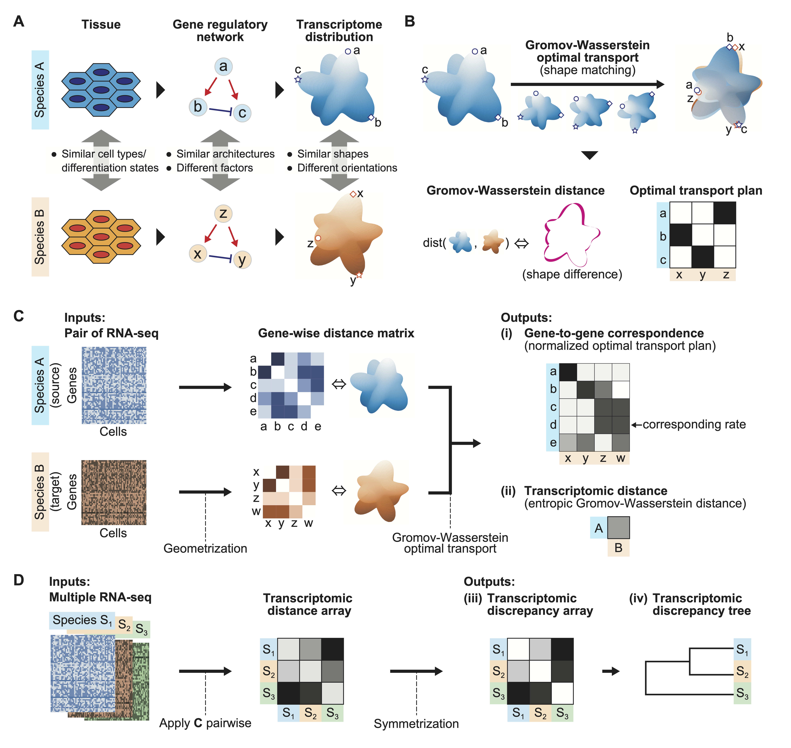

Species-OT documentation
========================

Geometric inference of cross-species transcriptome correspondence using Gromov–Wasserstein optimal transport．
GitHub project is here： `yuyatokuta/Species-OT <https://github.com/yuyatokuta/Species-OT>`_．

.. toctree::
   :maxdepth: 2
   :caption: README

   readme

.. toctree::
   :maxdepth: 2
   :caption: Tutorials

   tutorial1.ipynb
   tutorial2.ipynb
   tutorial3.ipynb

.. toctree::
   :maxdepth: 2
   :caption: API

   api

Indices and tables
==================

* :ref:`genindex`
* :ref:`search`
